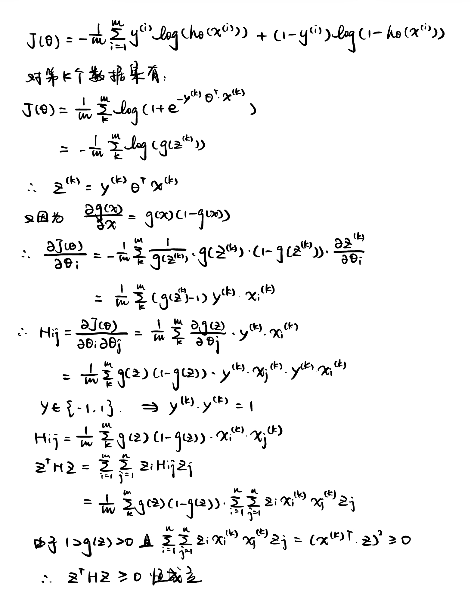
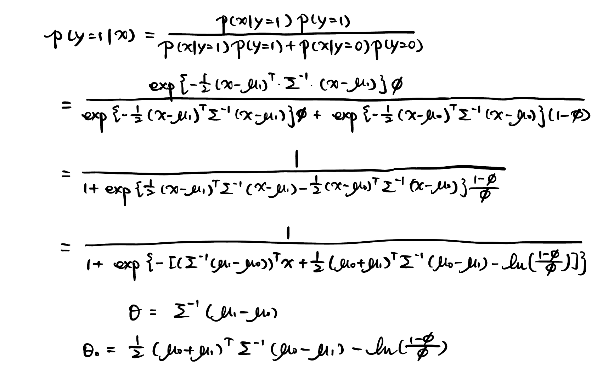
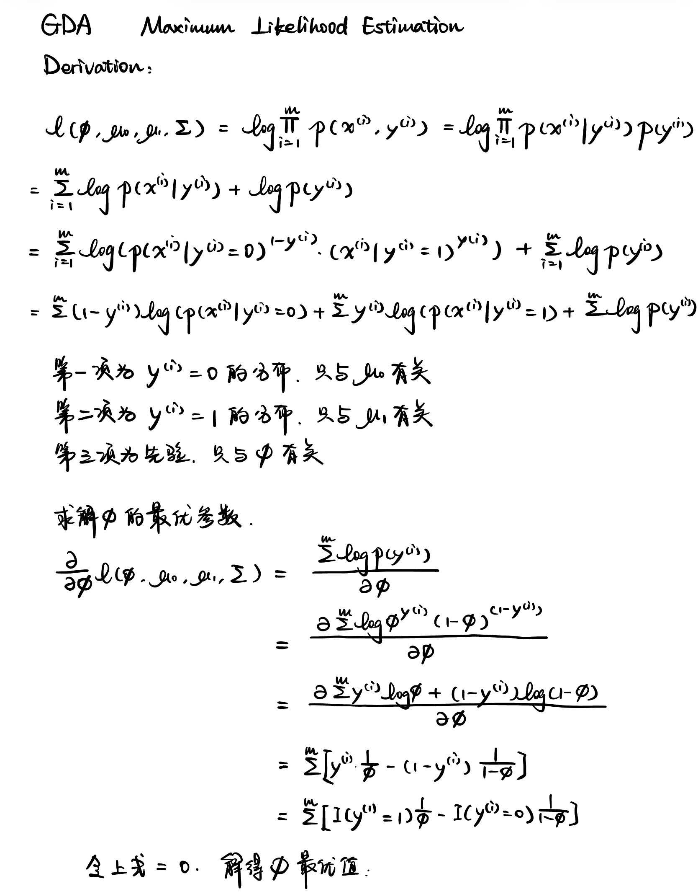
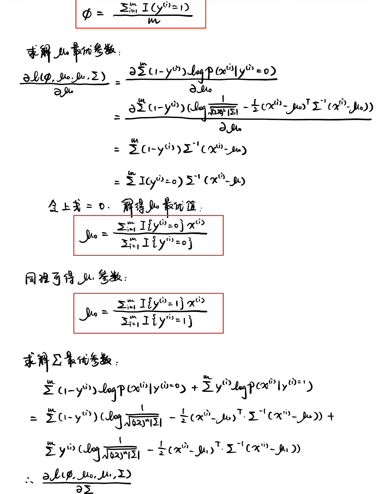
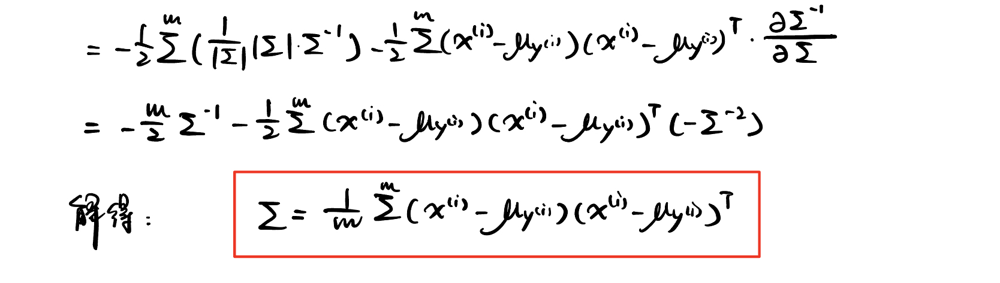
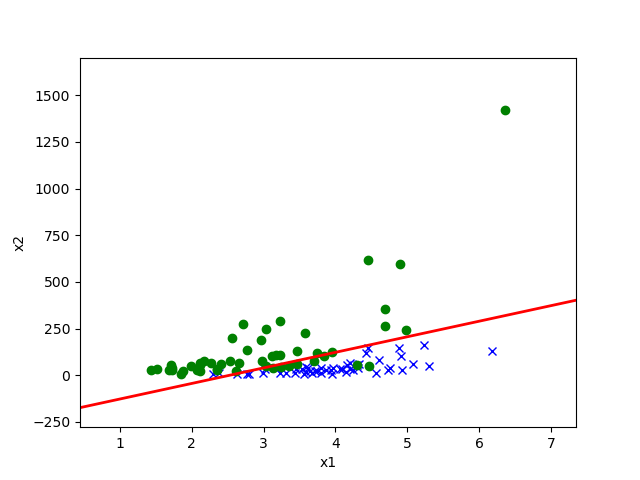
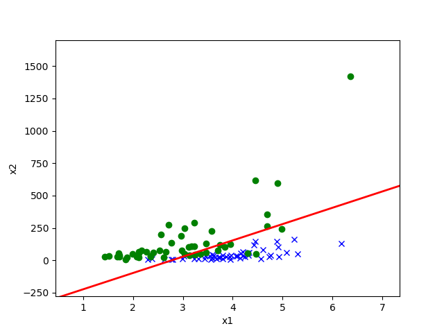
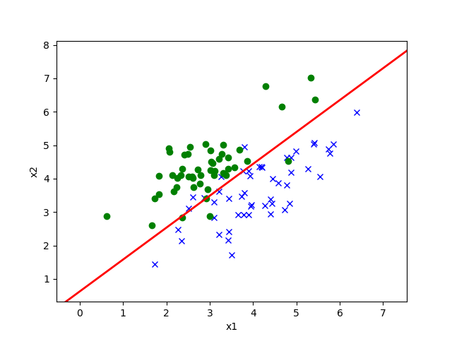

## 1. 求Hessian H，并证明条件成立

## 2. 代码题`p01b_logreg`

详见`p01b_logreg.py`

## 3. GDA后验分布

## 4. GDA最优参数证明

## 5. 代码题`p01e_gda`

详见`p01e_gda.py`

## 6. 第一个数据集图像绘制

对于第一个数据集，绘制训练数据图，横轴为$x_{1}$，纵轴为$x_{2}$，并使用不同的符号对 $y^{(i)}$ = 0 和 $y^{(i)}$ = 1 两个类别的示例 $x^{(i)}$ 进行表示。在同一张图上，绘制第 2 问中通过逻辑回归找到的决策边界。此外，再绘制一张同样的训练数据图，绘制第 5 问中通过 GDA 找到的决策边界。

1. LogisticRegression\

2. GDA\

## 7. 第二个数据集图像绘制

对于第二个数据集，绘制训练数据图，横轴为$x_{1}$，纵轴为$x_{2}$，并使用不同的符号对 $y^{(i)}$ = 0 和 $y^{(i)}$ = 1 两个类别的示例 $x^{(i)}$ 进行表示。在同一张图上，绘制第 2 问中通过逻辑回归找到的决策边界。此外，再绘制一张同样的训练数据图，绘制第 5 问中通过 GDA 找到的决策边界。

1. LogisticRegression\

2. GDA\

由图片可以发现，第一个数据集中，GDA的表现不如逻辑回归，因为GDA中我们假设的先验概率模型可能不是高斯分布的，这样拟合效果就会差很多，这也是GDA很大的一个缺点。

## 8. 修改变换改善GDA效果

对于拟合较差的正态分布，我们使用`Box Cox Transformation`进行变换，其变换如下：
$$
\mathbf{y}^{(\lambda)}=\begin{cases}\dfrac{\mathbf{y}^{\lambda}-1}{\lambda},\lambda\neq\mathbf{0}\\\mathbf{ln}(y),\lambda=\mathbf{0}\end{cases}
$$
_y为连续变量，且要求取值为正（若取值为负则需要对原始数据加上一个常数使其为正）。**λ为变换参数，不同的λ对应不同的变换方式**，当λ=0时相当于对数变换，λ=2时等同于平方变换，λ=1时等同于线性变换，相当于没有进行变换，λ=1/2时等同于平方根变换，λ=-1时等同于倒数变换。通过求解λ值即可确定具体的变换方式，λ值的估计方法可采用最大似然估计。_

文章链接[Box-Cox](https://mp.weixin.qq.com/s?__biz=MzIzNjk2NDg4NA==&mid=2247484194&idx=1&sn=42c795be25fffe3ca22e7d64624b84a8&chksm=e8ce9e59dfb9174f70e4e569ba248c602abf99c389a306374c4e8d2ab2b92d2a4222b2b81fd5&scene=21#wechat_redirect)

